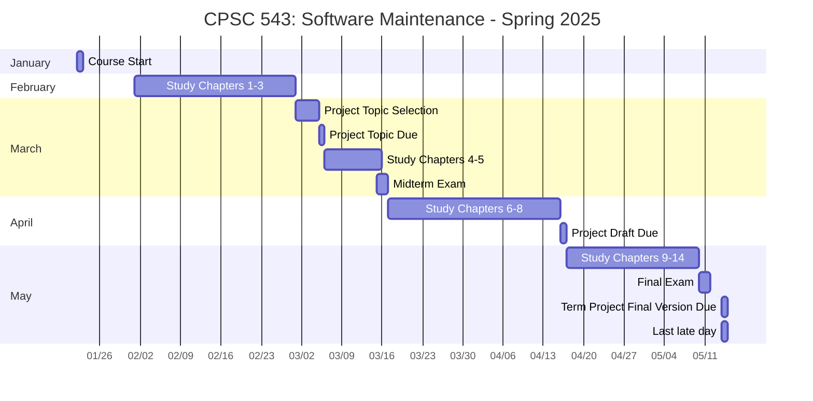

**Course Overview:**

This course, CPSC 543, delves into the crucial area of software maintenance. It will help you understand why software maintenance is important, how to build software ready for maintenance and what activities and management issues are involved. You'll be learning both the theoretical foundations and practical applications of maintaining large-scale software systems, including the use of maintenance metrics. The course is taught by Dr. Song-James Choi.

**Key Information:**

*   **Instructor:** Song-James Choi, Ph.D.
    *   **Office:** CS427
    *  **Phone:** (657)278-7257
    *   **Email:** jchoi@fullerton.edu
    *   **Office Hours:** Tuesdays and Thursdays from 5:30 PM to 6:30 PM via Zoom (link: [https://fullerton.zoom.us/j/85605249068](https://fullerton.zoom.us/j/85605249068))
*   **Prerequisites:** CPSC 362 or equivalent work experience.
*   **Required Textbook:** *Software Maintenance* by Grubb and Takang (2003). It is stated that the course will follow the book closely.
*   **Recommended Textbook:** *Practical Software Maintenance* by Pigoski (1997)
*   **Coursework:** The course is designed to give you hands-on experience and assessment on understanding the subject as you will have a term project, summarization of the reading materials, participation in discussion, midterm, and a final exam. You will also need to proactively engage with the online resources throughout the semester.

**Grading Breakdown:**

*   **Term Project:** 35%
    *   Project Topic Due: 3/5 (5%)
    *   Project Draft Due: 4/16 (5%)
    *   Final Version Due: 5/14 (25%)
*   **Midterm Exam:** 15%
    *   Available: 9 AM, 3/15 (Saturday) to 10 PM, 3/16 (Sunday)
    *   Absolute Deadline: 10:00 PM on 3/16 (Sunday)
    *   No Make-up Exam
    *   If you have an emergency that prevents you from taking the midterm, contact the instructor ASAP and provide appropriate evidence to have the test weight added to final exam (total of 50% for the final)
*   **Final Exam:** 30%
    *   Available: 9 AM, 5/10 (Saturday) to 10 PM, 5/11 (Sunday)
    *   Absolute Deadline: 10:00 PM on 5/11 (Sunday)
    *   Missing the final exam will be addressed per university policy.
*   **Class Participation:** 20%
    *   Chapter Summaries: 10%
        *   2-3 page summary for each chapter, in your own words
        *   Summaries should include concepts and application/opinions
        *   Submit all summaries for each part in a single file (Word or PDF)
    *   Forum Discussions: 10%
        *   At least 2 "meaningful" posts per chapter (totaling at least 28 posts)
        *   Discussions should related to the part 2 of your Chapter summaries
        *   No exam questions are allowed to discuss
        *   Forums for each part close when chapter summaries for that part are due

*   **Grading Scale:**
    *   90%+: A- or higher
    *   80-89%: B- or higher
    *   70-79%: C- or higher
    *   60-69%: D- or higher
    *   0-59%: F

**Important Notes:**

*   **Communication:** Check email and Canvas daily, or at least 2-3 times weekly.
*   **Late Submissions:** Late submissions (except forum posts) will be accepted but with a 20% deduction for the first day, plus 1% for each additional day. The absolute last day for late submissions is May 14th (Wednesday).
*   **Distance Learning:** The course is entirely online. All materials will be available on Canvas.
*   **Online Participation Tracking:** Online activity, such as discussion posts and frequency of accessing course materials will be tracked.
*   **Netiquette:** Follow the "Core Rules of Netiquette" outlined in the syllabus.
*   **Academic Honesty:** All work must be your own (except for team projects). Academic dishonesty will result in an "F" for the course.
*   **ADA Accommodations:** Contact the Office of Disability Support Services within the first week of classes for any special accommodations.
*   **Emergency Procedures**: You should review the emergency procedures guidelines.
*   **Contact Instructor:** Don't hesitate to contact the instructor with any course-related problems.

**Time Chart (Mermaid Gantt):**

**Explanation:**

*   **`gantt`**: declares the start of a Gantt diagram.
*   **`title`**: sets a title for the chart.
*   **`dateFormat YYYY-MM-DD`**: configures the date format for axis and data.
*   **`axisFormat %m/%d`**: sets the axis format as month/day.
*   **`section`**: groups tasks by month.
*   **`Task : startDate, duration`**: specifies task details. `d` represent days duration.

**How to Use This Information:**

*   **Stay Organized:** Use the time chart as a guide to pace your work throughout the semester.
*   **Be Proactive:** Start your project early.  Sign up for a topic and work on it little by little.
*   **Time Management:** Plan your study sessions to keep up with chapter readings and summaries.
*   **Engage:** Make sure to participate in the forums regularly to earn participation points.  Aim for 2+ meaningful posts for each chapter.
